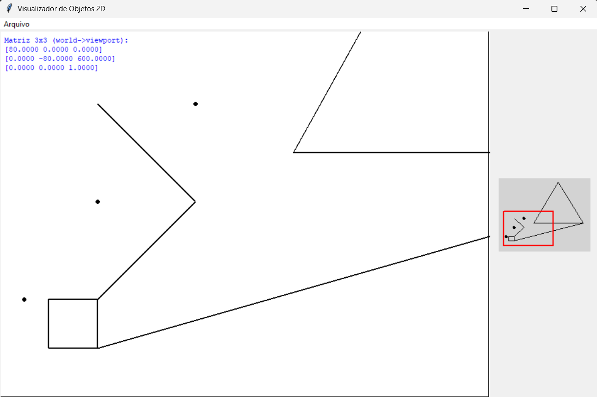

# Visualizador de Objetos 2D - Transformada de Viewport

Um projeto de computação gráfica que implementa a **Transformada de Viewport** para visualização de objetos geométricos 2D. O sistema permite carregar objetos a partir de arquivos XML e visualizá-los em uma interface gráfica interativa.



## 📋 Descrição

Este projeto implementa os conceitos fundamentais de computação gráfica relacionados à transformação de coordenadas do mundo (world coordinates) para coordenadas da viewport (viewport coordinates). O visualizador permite:

- Carregar objetos geométricos 2D a partir de arquivos XML
- Visualizar pontos, retas e polígonos
- Navegar pela viewport usando as teclas direcionais
- Visualizar um minimapa com a área atual em foco
- Exibir a matriz de transformação 3x3 em tempo real

## 🛠️ Tecnologias Utilizadas

- **Python 3.x**
- **Tkinter** - Interface gráfica
- **xml.etree.ElementTree** - Parsing de arquivos XML

## 📁 Estrutura do Projeto

```
CG1/
├── ideia_interface.ipynb           # Código principal (Jupyter Notebook)
├── entrada.xml                     # Arquivo de exemplo com objetos geométricos
├── entrada_extra.xml               # Arquivo adicional com mais objetos para teste
├── image.png                       # Screenshot da interface do visualizador
├── RELATÓRIO_TRABALHO PRÁTICO 1.pdf  # Relatório técnico completo do projeto
└── README.md                       # Este arquivo
```

## 🚀 Como Executar

### Pré-requisitos
- Python 3.x instalado
- Jupyter Notebook (opcional, para executar o notebook)

### Executando o projeto

1. **Via Jupyter Notebook** (recomendado):
   ```bash
   jupyter notebook ideia_interface.ipynb
   ```
   Execute a célula de código para iniciar a aplicação.

2. **Via Python direto**:
   Extraia o código da célula Python do notebook e salve em um arquivo `.py`, então execute:
   ```bash
   python visualizador.py
   ```

## 📋 Formato do Arquivo XML

O sistema aceita arquivos XML com a seguinte estrutura:

```xml
<?xml version="1.0" ?>
<dados>
    <!-- Configuração da viewport -->
    <viewport>
        <vpmin x="0" y="0"/>
        <vpmax x="800" y="600"/>
    </viewport>
    
    <!-- Configuração da window (mundo) -->
    <window>
        <wmin x="0.0" y="0.0"/>
        <wmax x="10.0" y="7.5"/>
    </window>

    <!-- Objetos geométricos -->
    <ponto x="2" y="4"/>
    
    <reta>
        <ponto x="2" y="2"/>
        <ponto x="4" y="4"/>
    </reta>
    
    <poligono>
        <ponto x="1.0" y="1.0"/>
        <ponto x="1.0" y="2.0"/>
        <ponto x="2.0" y="2.0"/>
        <ponto x="2.0" y="1.0"/>
    </poligono>
</dados>
```

### Elementos Suportados

- **`<viewport>`**: Define o tamanho da área de visualização em pixels
  - `vpmin`: Coordenada mínima (canto inferior esquerdo)
  - `vpmax`: Coordenada máxima (canto superior direito)

- **`<window>`**: Define a área do mundo que será visualizada
  - `wmin`: Coordenada mínima do mundo
  - `wmax`: Coordenada máxima do mundo

- **`<ponto>`**: Define um ponto com coordenadas `x` e `y`

- **`<reta>`**: Define uma linha com dois pontos

- **`<poligono>`**: Define um polígono com três ou mais pontos

## 🎮 Controles

- **↑ ↓ ← →**: Navegar pela viewport (mover a window)
- **Menu Arquivo > Abrir**: Carregar um arquivo XML

## 🧮 Conceitos Implementados

### Transformada de Viewport

A transformação de coordenadas do mundo para a viewport é implementada através de uma matriz 3x3:

```
M = [sx   0   vpxmin - sx * wxmin  ]
    [0   -sy  vpymin + sy * wymax ]
    [0    0   1.0                 ]
```

Onde:
- `sx = (vpxmax - vpxmin) / (wxmax - wxmin)` - Fator de escala em X
- `sy = (vpymax - vpymin) / (wymax - wymin)` - Fator de escala em Y
- O sinal negativo em `sy` inverte o eixo Y para coordenadas de tela

### Componentes da Interface

1. **Viewport Principal**: Área principal onde os objetos são renderizados
2. **Minimapa**: Visão geral dos objetos com indicação da área atual em foco
3. **Exibição da Matriz**: Mostra a matriz de transformação atual no canto superior esquerdo

## 📊 Funcionalidades

- ✅ Carregamento de arquivos XML
- ✅ Renderização de pontos, retas e polígonos
- ✅ Navegação interativa com teclas direcionais
- ✅ Minimapa com área de foco
- ✅ Exibição da matriz de transformação
- ✅ Redimensionamento automático da viewport baseado no arquivo

## 🔧 Estrutura do Código

### Classe Principal: `Visualizador`

- **`__init__`**: Inicializa a interface gráfica e configurações
- **`abrir_arquivo`**: Abre diálogo para seleção de arquivo XML
- **`carregar_arquivo`**: Faz o parsing do XML e configura os objetos
- **`window2viewport`**: Aplica a transformada de viewport a um ponto
- **`desenhar_viewport`**: Renderiza os objetos na viewport principal
- **`desenhar_minimapa`**: Renderiza o minimapa
- **`_mover_e_recarregar`**: Move a window e atualiza a visualização

## 🎯 Exemplo de Uso

1. Execute a aplicação
2. Use "Arquivo > Abrir" para carregar um dos arquivos de exemplo:
   - `entrada.xml` - Exemplo básico com poucos objetos
   - `entrada_extra.xml` - Exemplo mais complexo com diversos objetos e um polígono grande
3. Use as setas do teclado para navegar pela cena
4. Observe como a matriz de transformação muda conforme você navega
5. O retângulo vermelho no minimapa mostra a área atual em foco

### Arquivos de Exemplo Disponíveis

- **`entrada.xml`**: Arquivo de demonstração básico contendo:
  - 3 pontos simples
  - 3 retas
  - 2 polígonos (quadrado e triângulo)
  - Window de 10.0 x 7.5 unidades

- **`entrada_extra.xml`**: Arquivo de teste mais abrangente contendo:
  - 3 pontos distribuídos pela cena
  - 2 retas diagonais
  - 3 polígonos incluindo um grande que atravessa toda a cena
  - Window de 20 x 15 unidades para demonstrar navegação

## 📚 Conceitos de Computação Gráfica

Este projeto demonstra conceitos fundamentais como:

- **Sistema de Coordenadas**: Transformação entre coordenadas do mundo e da tela
- **Viewport Transformation**: Mapeamento de uma região do mundo para a tela
- **Matriz de Transformação**: Representação matemática das transformações
- **Clipping implícito**: Objetos fora da viewport não são exibidos
- **Rendering 2D**: Desenho de primitivas geométricas

## 📄 Licença

Este projeto é desenvolvido para fins educacionais em computação gráfica.

---

**Desenvolvido como parte do estudo de Computação Gráfica - Transformada de Viewport**